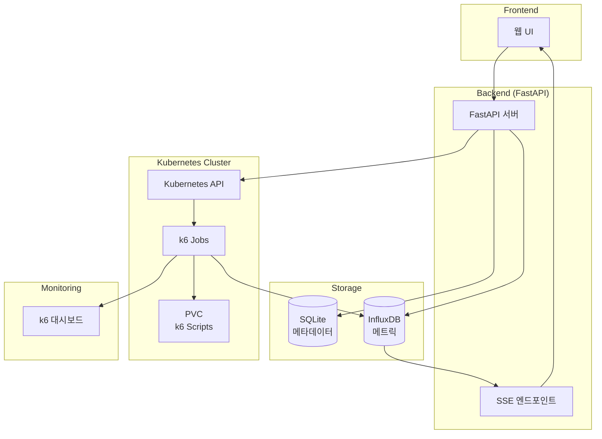

# Metric Vault

**FastAPI 기반 API 성능 테스트 및 메트릭 수집 플랫폼**

Kubernetes와 k6를 활용하여 RESTful API의 부하 테스트를 실행하고, 실시간 메트릭을 수집 및 분석할 수 있는 웹 기반 플랫폼입니다.

## 📋 목차

- [주요 기능](#주요-기능)
- [시스템 아키텍처](#시스템-아키텍처)
- [기술 스택](#기술-스택)
- [설치 및 실행](#설치-및-실행)
- [데이터베이스 스키마](#데이터베이스-스키마)
- [API 문서](#api-문서)
- [사용법](#사용법)
- [환경 변수](#환경-변수)
- [개발](#개발)

## ✨ 주요 기능

### 🎯 프로젝트 관리
- **프로젝트 생성/조회/삭제**: API 테스트 프로젝트를 체계적으로 관리
- **계층형 구조**: 프로젝트 → OpenAPI 스펙 → 태그 → 엔드포인트

### 🔍 OpenAPI 분석
- **자동 스펙 분석**: OpenAPI/Swagger 문서를 자동으로 파싱하여 엔드포인트 추출
- **태그 기반 분류**: API 엔드포인트를 태그별로 분류 및 관리
- **엔드포인트 상세 정보**: HTTP 메소드, 경로, 설명 등 상세 정보 저장

### 🚀 부하 테스트 실행
- **k6 스크립트 자동 생성**: GUI를 통한 테스트 설정으로 k6 JavaScript 스크립트 자동 생성
- **Kubernetes 기반 실행**: k6 테스트를 Kubernetes Job으로 실행하여 확장성 보장
- **다양한 실행 모드**: constant-vus, ramping-vus 등 다양한 부하 패턴 지원
- **실시간 모니터링**: k6 웹 대시보드를 통한 실시간 테스트 모니터링

### 📊 메트릭 수집 및 분석
- **InfluxDB 연동**: 시계열 데이터베이스를 통한 고성능 메트릭 저장
- **실시간 스트리밍**: Server-Sent Events(SSE)를 통한 실시간 메트릭 스트리밍
- **종합 분석**: TPS, 응답시간, 에러율, 가상 사용자 수 등 종합적인 성능 메트릭
- **시나리오별 분석**: 엔드포인트별 상세 성능 분석

### 📈 테스트 이력 관리
- **테스트 기록 저장**: 모든 테스트 실행 이력과 결과를 체계적으로 보관
- **상세 결과 조회**: 전체 테스트 및 시나리오별 상세 메트릭 제공
- **트렌드 분석**: 시간별 성능 변화 추이 분석 가능

## 🏗️ 시스템 아키텍처



### 주요 컴포넌트

1. **FastAPI 서버**: RESTful API 제공 및 비즈니스 로직 처리
2. **SQLite 데이터베이스**: 프로젝트, 엔드포인트, 테스트 메타데이터 저장
3. **InfluxDB**: 시계열 성능 메트릭 데이터 저장
4. **Kubernetes**: k6 부하 테스트 Job 실행 환경
5. **k6**: 실제 부하 테스트 실행 엔진
6. **SSE**: 실시간 메트릭 스트리밍

## 🛠 기술 스택

### Backend
- **FastAPI 0.115.13**: 고성능 비동기 웹 프레임워크
- **Python 3.11**: 최신 Python 런타임
- **SQLAlchemy 2.0.41**: ORM 및 데이터베이스 추상화 레이어
- **Pydantic 2.11.7**: 데이터 검증 및 직렬화

### Database
- **SQLite**: 경량 관계형 데이터베이스 (메타데이터 저장)
- **InfluxDB 5.3.2**: 시계열 데이터베이스 (메트릭 저장)

### Infrastructure
- **Kubernetes 33.1.0**: 컨테이너 오케스트레이션
- **Docker**: 컨테이너화
- **k6**: 부하 테스트 도구

### Additional Tools
- **Uvicorn**: ASGI 웹 서버
- **HTTPX**: 비동기 HTTP 클라이언트
- **python-dotenv**: 환경 변수 관리

## 🚀 설치 및 실행

### 1. 사전 요구사항

- Python 3.11+
- Docker & Docker Compose
- Kubernetes 클러스터 (로컬 또는 원격)
- k6-script-pvc PVC 생성됨

### 2. 환경 설정

```bash
# 저장소 클론
git clone <repository-url>
cd metric-vault

# 가상 환경 생성 및 활성화
python -m venv venv
source venv/bin/activate  # Linux/Mac
# 또는
venv\Scripts\activate     # Windows

# 의존성 설치
pip install -r requirements.txt
```

### 3. 환경 변수 설정

`.env` 파일을 생성하고 다음 설정을 추가하세요:

```bash
# InfluxDB 설정
INFLUXDB_HOST=localhost
INFLUXDB_PORT=8086
INFLUXDB_DATABASE=k6

# k6 설정
K6_SCRIPT_FILE_FOLDER=/mnt/k6-scripts
K6_DEFAULT_PVC=k6-script-pvc

# Kubernetes 설정
KUBERNETES_NAMESPACE=default

# 스케줄러 설정
SCHEDULER_POLL_INTERVAL=15
SCHEDULER_MAX_RETRY=3
SCHEDULER_METRICS_DELAY=30
SCHEDULER_JOB_TIMEOUT_HOURS=4
SCHEDULER_JOB_WARNING_HOURS=1

# 로깅 설정
LOG_LEVEL=INFO

# 자동 정리 설정
AUTO_DELETE_COMPLETED_JOBS=true
```

### 4. 애플리케이션 실행

#### 개발 모드
```bash
uvicorn app.main:app --host 0.0.0.0 --port 8000 --reload
```

#### 프로덕션 모드 (Docker)
```bash
# Docker 이미지 빌드
docker build -t metric-vault .

# 컨테이너 실행
docker run -p 8000:8000 metric-vault
```

### 5. 접속 확인

- **API 문서**: http://localhost:8000/api/swagger
- **헬스 체크**: http://localhost:8000/

## 🗄 데이터베이스 스키마

### ERD (Entity Relationship Diagram)

```mermaid
erDiagram
    PROJECT {
        int id PK
        string title
        string summary
        text description
    }
    
    OPENAPI_SPEC {
        int id PK
        string title
        string version
        string base_url
        int project_id FK
    }
    
    TAG {
        int id PK
        string name
        string description
        int openapi_spec_id FK
    }
    
    ENDPOINT {
        int id PK
        string path
        string method
        text summary
        text description
    }
    
    TAG_ENDPOINT {
        int endpoint_id FK
        int tag_id FK
    }
    
    TEST_HISTORY {
        int id PK
        string title
        text description
        float target_tps
        datetime tested_at
        string job_name
        string k6_script_file_name
        boolean is_completed
        datetime completed_at
        int project_id FK
        float max_tps
        float min_tps
        float avg_tps
        float max_response_time
        float min_response_time
        float avg_response_time
        float p50_response_time
        float p95_response_time
        float p99_response_time
        float max_error_rate
        float min_error_rate
        float avg_error_rate
        float max_vus
        float min_vus
        float avg_vus
        int total_requests
        int failed_requests
        float test_duration
    }
    
    SCENARIO_HISTORY {
        int id PK
        string name
        string scenario_tag
        int endpoint_id FK
        float think_time
        string executor
        float response_time_target
        float error_rate_target
        int total_requests
        int failed_requests
        float test_duration
        float max_tps
        float min_tps
        float avg_tps
        float max_response_time
        float min_response_time
        float avg_response_time
        float p50_response_time
        float p95_response_time
        float p99_response_time
        float max_error_rate
        float min_error_rate
        float avg_error_rate
        int test_history_id FK
    }
    
    STAGE_HISTORY {
        int id PK
        string duration
        int target
        int scenario_id FK
    }
    
    PROJECT ||--o{ OPENAPI_SPEC : contains
    PROJECT ||--o{ TEST_HISTORY : has
    OPENAPI_SPEC ||--o{ TAG : includes
    TAG }o--o{ ENDPOINT : categorizes
    ENDPOINT ||--o{ SCENARIO_HISTORY : tests
    TEST_HISTORY ||--o{ SCENARIO_HISTORY : contains
    SCENARIO_HISTORY ||--o{ STAGE_HISTORY : defines
```



### 주요 테이블 설명

#### 📁 PROJECT
- **목적**: API 테스트 프로젝트의 최상위 컨테이너
- **관계**: OpenAPI 스펙과 테스트 이력을 포함

#### 📋 OPENAPI_SPEC  
- **목적**: 프로젝트 내 개별 서버/API 명세 정보
- **주요 필드**: base_url (서버 기본 URL)

#### 🏷 TAG
- **목적**: API 엔드포인트의 논리적 그룹화
- **관계**: 엔드포인트와 다대다 관계

#### 🔗 ENDPOINT
- **목적**: 개별 API 엔드포인트 정보 저장
- **주요 필드**: HTTP 메소드, 경로, 설명

#### 📊 TEST_HISTORY
- **목적**: 부하 테스트 실행 기록 및 전체 결과 메트릭
- **메트릭**: TPS, 응답시간, 에러율, VUS 등 종합 성능 지표

#### 🎯 SCENARIO_HISTORY
- **목적**: 개별 시나리오(엔드포인트별) 테스트 결과
- **설정**: executor, think_time, 성능 목표값
- **메트릭**: 시나리오별 상세 성능 지표

#### ⏱ STAGE_HISTORY
- **목적**: k6 부하 테스트 단계별 설정 (duration, target users)

## 📚 API 문서

### 🏠 Home
- `GET /` - 헬스 체크

### 📁 Project Management
- `POST /project` - 프로젝트 생성
- `GET /project` - 프로젝트 목록 조회  
- `GET /project/{project_id}` - 프로젝트 상세 조회
- `DELETE /project/{project_id}` - 프로젝트 삭제

### 📋 OpenAPI Analysis
- `POST /openapi/analyze` - OpenAPI 스펙 분석 및 저장
- `GET /openapi` - OpenAPI 스펙 목록 조회
- `DELETE /openapi/{openapi_spec_id}` - OpenAPI 스펙 삭제

### 🔗 Endpoint Management  
- `GET /endpoint` - 엔드포인트 목록 조회

### 🚀 Load Testing
- `POST /load-testing` - k6 부하 테스트 실행

### 📊 Test History
- `GET /test-history/simple` - 테스트 기록 간단 조회 (메인보드용)
- `GET /test-history/projects/{project_id}` - 프로젝트별 테스트 기록 조회
- `GET /test-history/{test_history_id}/details` - 테스트 기록 상세 조회

### ⚙️ Job Scheduler
- `GET /scheduler/jobs` - 실행 중인 k6 Job 목록 조회

### 📡 Server-Sent Events (SSE)
- `GET /sse/k6-data` - 실시간 k6 메트릭 스트리밍

자세한 API 문서는 애플리케이션 실행 후 `/api/swagger`에서 확인할 수 있습니다.

## 🎯 사용법

### 1. 프로젝트 생성
```bash
curl -X POST "http://localhost:8000/project" \
-H "Content-Type: application/json" \
-d '{
  "title": "My API Project",
  "summary": "테스트 프로젝트",
  "description": "상세 설명"
}'
```

### 2. OpenAPI 스펙 분석
```bash
curl -X POST "http://localhost:8000/openapi/analyze" \
-H "Content-Type: application/json" \
-d '{
  "project_id": 1,
  "openapi_url": "https://api.example.com/swagger.json"
}'
```

### 3. 부하 테스트 실행
```bash
curl -X POST "http://localhost:8000/load-testing" \
-H "Content-Type: application/json" \
-d '{
  "title": "Performance Test",
  "description": "API 성능 테스트",
  "target_tps": 100,
  "scenarios": [
    {
      "name": "login_test",
      "endpoint_id": 1,
      "executor": "constant-vus",
      "think_time": 1.0,
      "stages": [
        {
          "duration": "30s",
          "target": 10
        }
      ]
    }
  ]
}'
```

### 4. 실시간 모니터링
SSE를 통한 실시간 메트릭 스트리밍:
```javascript
const eventSource = new EventSource('http://localhost:8000/sse/k6-data');
eventSource.onmessage = function(event) {
  const data = JSON.parse(event.data);
  console.log('실시간 메트릭:', data);
};
```

## 🌍 환경 변수

| 변수명 | 기본값 | 설명 |
|--------|--------|------|
| `INFLUXDB_HOST` | `localhost` | InfluxDB 서버 호스트 |
| `INFLUXDB_PORT` | `8086` | InfluxDB 서버 포트 |
| `INFLUXDB_DATABASE` | `k6` | InfluxDB 데이터베이스 명 |
| `K6_SCRIPT_FILE_FOLDER` | `/mnt/k6-scripts` | k6 스크립트 저장 경로 |
| `K6_DEFAULT_PVC` | `k6-script-pvc` | Kubernetes PVC 이름 |
| `KUBERNETES_NAMESPACE` | `default` | Kubernetes 네임스페이스 |
| `SCHEDULER_POLL_INTERVAL` | `15` | 스케줄러 폴링 간격(초) |
| `SCHEDULER_MAX_RETRY` | `3` | 최대 재시도 횟수 |
| `SCHEDULER_METRICS_DELAY` | `30` | 메트릭 수집 지연(초) |
| `SCHEDULER_JOB_TIMEOUT_HOURS` | `4` | Job 타임아웃(시간) |
| `SCHEDULER_JOB_WARNING_HOURS` | `1` | Job 경고 시간(시간) |
| `LOG_LEVEL` | `INFO` | 로그 레벨 |
| `AUTO_DELETE_COMPLETED_JOBS` | `true` | 완료된 Job 자동 삭제 여부 |

## 🔧 개발

### 프로젝트 구조
```
metric-vault/
├── app/
│   ├── api/                 # API 라우터
│   │   ├── project_router.py
│   │   ├── openapi_router.py
│   │   ├── load_testing_router.py
│   │   └── test_history_router.py
│   ├── common/              # 공통 컴포넌트
│   │   ├── exception/
│   │   ├── middleware/
│   │   └── response/
│   ├── core/                # 설정
│   │   └── config.py
│   ├── db/                  # 데이터베이스
│   │   ├── sqlite/
│   │   └── influxdb/
│   ├── dto/                 # 데이터 전송 객체
│   ├── services/            # 비즈니스 로직
│   ├── scheduler/           # k6 Job 스케줄러
│   ├── sse/                 # Server-Sent Events
│   └── main.py             # 애플리케이션 진입점
├── k8s/                    # Kubernetes 관련
│   ├── k8s_client.py
│   └── k8s_service.py
├── tests/                  # 테스트
├── requirements.txt        # Python 의존성
├── Dockerfile             # Docker 설정
└── README.md
```

### 로컬 개발 환경 구성

1. **InfluxDB 시작**:
```bash
docker run -d -p 8086:8086 \
  -e INFLUXDB_DB=k6 \
  -e INFLUXDB_ADMIN_USER=admin \
  -e INFLUXDB_ADMIN_PASSWORD=admin \
  influxdb:1.8
```

2. **Kubernetes PVC 생성**:
```yaml
apiVersion: v1
kind: PersistentVolumeClaim
metadata:
  name: k6-script-pvc
spec:
  accessModes:
    - ReadWriteOnce
  resources:
    requests:
      storage: 1Gi
```

3. **개발 서버 시작**:
```bash
uvicorn app.main:app --host 0.0.0.0 --port 8000 --reload
```

### 코드 스타일
- **Python**: PEP 8 준수
- **타입 힌트**: Pydantic 모델 활용
- **비동기**: async/await 패턴 사용
- **에러 처리**: 표준화된 예외 처리

---

## 🤝 기여하기

1. 저장소를 Fork 합니다
2. 기능 브랜치를 생성합니다 (`git checkout -b feature/amazing-feature`)
3. 변경사항을 커밋합니다 (`git commit -m 'Add amazing feature'`)
4. 브랜치에 푸시합니다 (`git push origin feature/amazing-feature`)
5. Pull Request를 생성합니다

## 📄 라이센스

이 프로젝트는 MIT 라이센스 하에 배포됩니다. 자세한 내용은 [LICENSE](LICENSE) 파일을 참조하세요.

---

**❤️ FastAPI, Kubernetes, k6로 제작되었습니다**