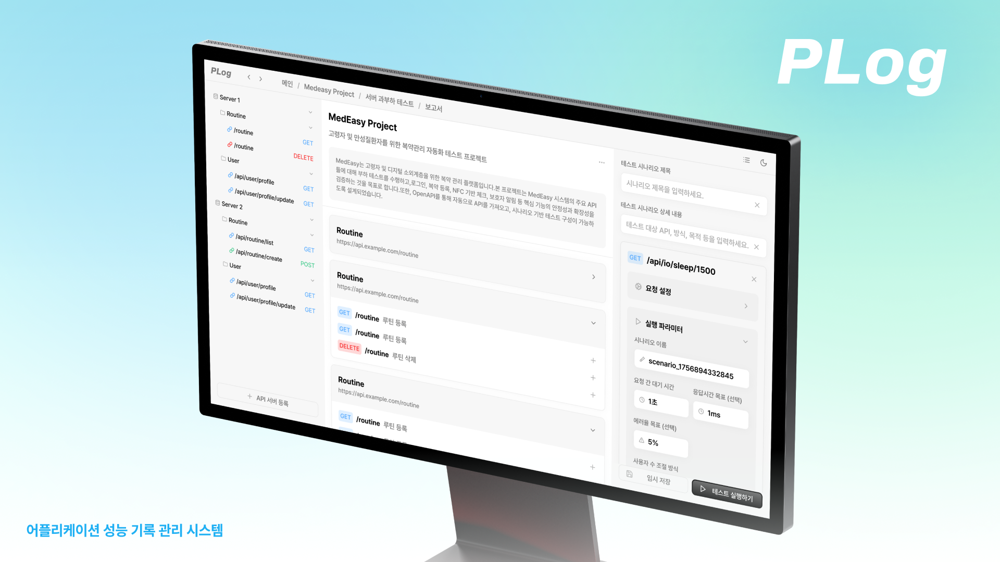
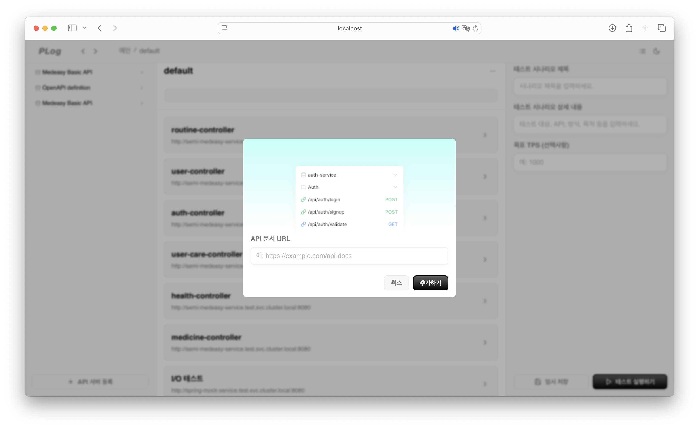
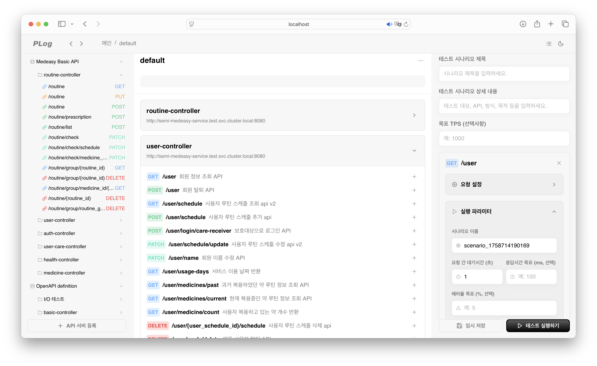
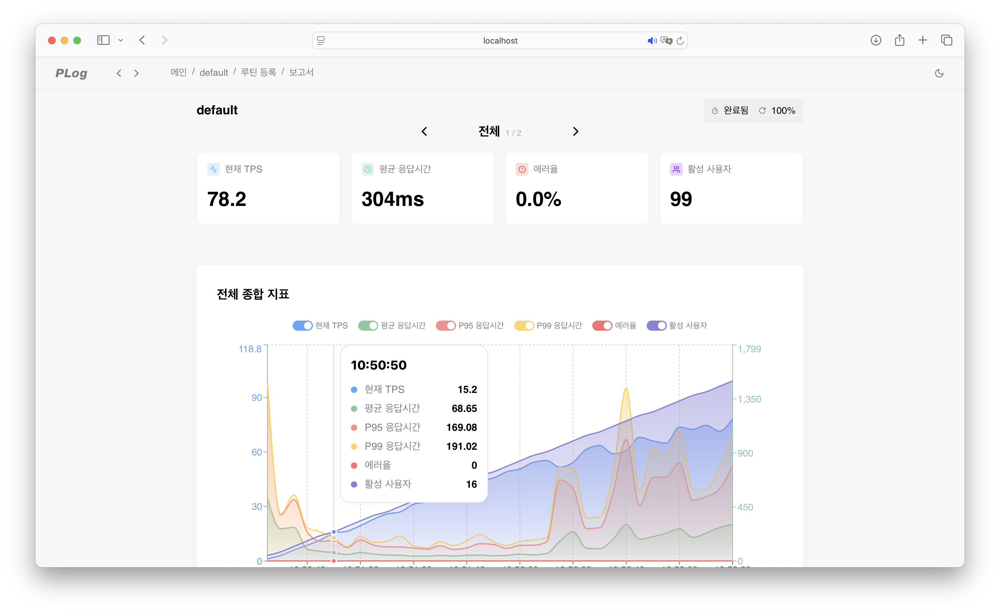
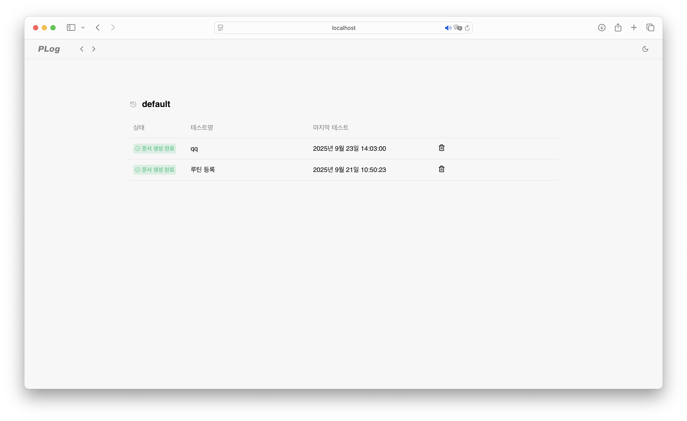
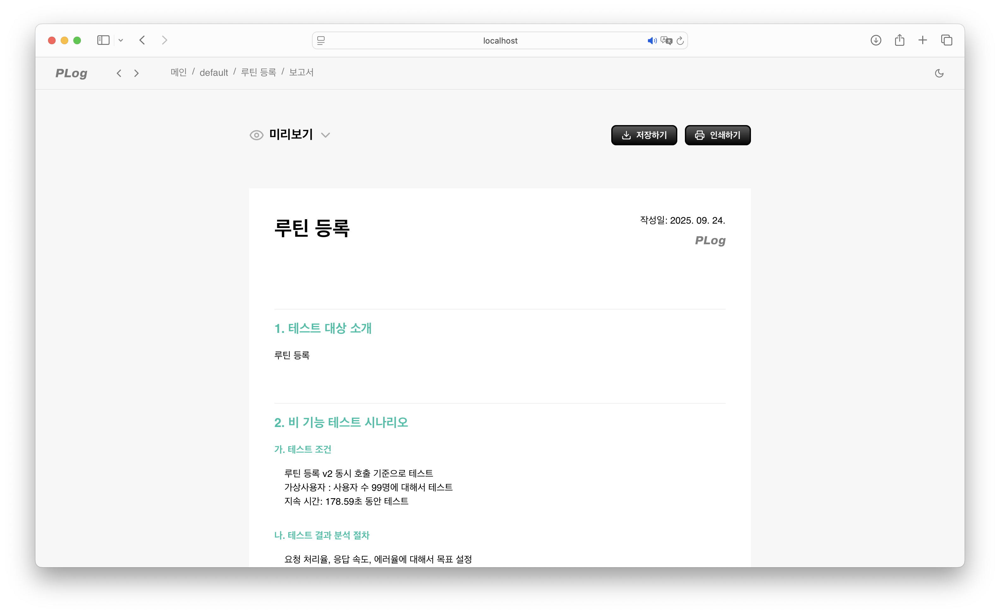
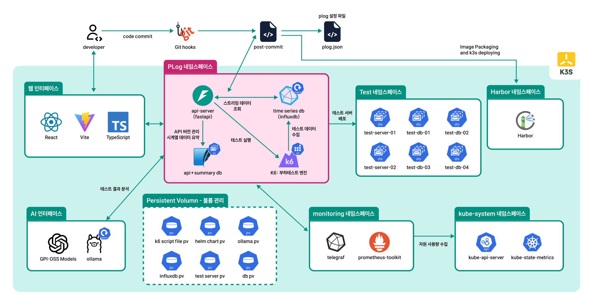
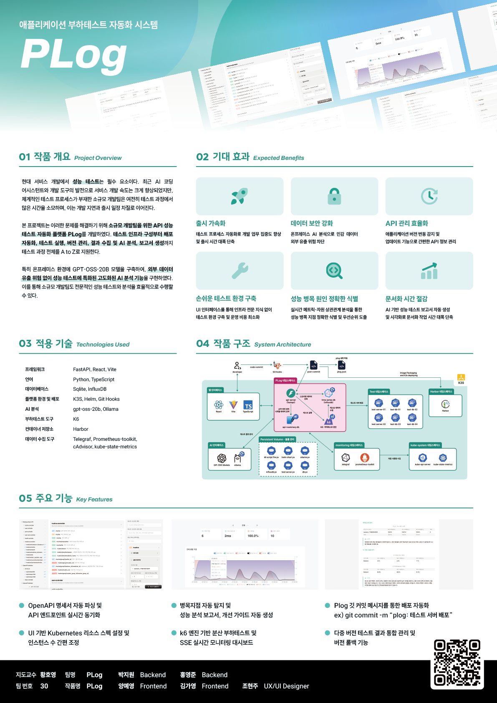

# 📊 PLog - 애플리케이션 부하테스트 자동화 시스템

### API 성능 테스트의 모든 것,

### 복잡한 테스트 과정을 자동화된 플랫폼으로!

> [!TIP]
> PLog는 소규모 개발팀을 위한 **API 성능 테스트 자동화 플랫폼**입니다.
> OpenAPI 문서를 불러와 테스트 시나리오를 구성하고, 부하 테스트 실행부터 실시간 모니터링, 결과 저장과 버전 관리, AI 기반 리포트 생성까지 전 과정을 지원합니다.
> 복잡한 인프라 구축이나 수동 테스트 과정 없이, 팀이 빠르고 안정적으로 성능을 검증할 수 있도록 돕습니다.

## 1. 작품 개요 (Overview)

현대 서비스 개발에서 성능 테스트는 필수 요소이다. 최근 AI 코딩 어시스턴트와 개발 도구의 발전으로 서비스 개발 속도는 크게 향상되었지만, **체계적인 테스트 프로세스가 부재한 소규모 개발팀은 여전히 테스트 과정에서 많은 시간을 소모**하며, 이는 **개발 지연과 출시 일정 차질**로 이어진다.

본 프로젝트는 이러한 문제를 해결하기 위해 **소규모 개발팀을 위한 API 성능 테스트 자동화 플랫폼 PLog**를 개발하였다. **테스트 인프라 구성부터 배포 자동화, 테스트 실행, 버전 관리, 결과 수집 및 AI 분석, 보고서 생성**까지 테스트 과정 전체를 A to Z로 지원한다.

특히 **온프레미스 환경에 GPT-OSS-20B 모델을 구축**하여 외부 데이터 유출 위험 없이 성능 테스트에 특화된 고도화된 AI 분석 기능을 구현하였다. 이를 통해 **소규모 개발팀도 전문적인 성능 테스트와 분석**을 효율적으로 수행할 수 있다.

## 2. 주요 기능 (Features)

| OpenAPI 기반 자동화                                                  | 부하 테스트 실행                                     |
| -------------------------------------------------------------------- | ---------------------------------------------------- |
|                                                  |                                  |
| OpenAPI 명세서를 불러와 엔드포인트와 테스트 시나리오를 자동으로 구성 | k6 기반 분산 부하 테스트 / 시나리오별 실행 옵션 제공 |

| 실시간 모니터링                                           | 결과 저장 및 버전 관리                  |
| --------------------------------------------------------- | --------------------------------------- |
|                                       |                     |
| TPS, 응답 시간, 에러율 등 주요 지표를 대시보드로 스트리밍 | 여러 버전의 테스트 결과를 기록하고 비교 |

| AI 분석 리포트                                                    | 배포 자동화 연계                                |
| ----------------------------------------------------------------- | ----------------------------------------------- |
|                                               |                             |
| 온프레미스 환경의 LLM을 이용한 성능 분석 및 개선 가이드 자동 생성 | Git 커밋 기반으로 컨테이너 빌드·배포까지 자동화 |

## 3. 기대 효과 (Expected Benefits)

| 효과                    | 설명                                                                           |
| ----------------------- | ------------------------------------------------------------------------------ |
| 출시 가속화             | 테스트 프로세스 자동화로 개발 업무 집중도 향상 및 출시 시간 단축               |
| 데이터 보안 강화        | 온프레미스 AI 분석으로 민감 데이터 외부 유출 위험 차단                         |
| API 관리 효율화         | 애플리케이션 버전 변동 감지 및 업데이트 기능으로 간편한 API 정보 관리          |
| 손쉬운 테스트 환경 구축 | UI 기반 환경 설정으로 인프라 전문 지식 없이 테스트 환경 구성 및 운영 비용 절감 |
| 성능 병목 원인 식별     | 메트릭-자원 상관관계 분석으로 성능 병목을 정확히 파악하고 우선순위 도출        |
| 문서화 시간 절감        | AI 기반 성능 리포트 자동 생성으로 문서화 작업 시간 절약                        |

## 4. 적용 기술 (Tech Stack)

| 영역               | 기술 스택                                                  |
| ------------------ | ---------------------------------------------------------- |
| Backend Framework  | FastAPI                                                    |
| Frontend Framework | React, Vite                                                |
| Language           | Python, TypeScript                                         |
| Database           | SQLite, InfluxDB                                           |
| Platform & 배포    | K3S, Helm, Git Hooks                                       |
| 부하 테스트        | k6                                                         |
| 메트릭 수집        | Telegraf, cAdvisor, Prometheus toolkit, kube-state-metrics |
| Registry           | Harbor                                                     |
| AI 분석            | gpt-oss-20b, LoRA                                          |

## 5. 시스템 구조 (System Architecture)

## 6. 포스터

## 7. 팀 소개 (Team)

| Profile                                                                          | Name   | Role         | Contact                                                                                                        |
| -------------------------------------------------------------------------------- | ------ | ------------ | -------------------------------------------------------------------------------------------------------------- |
|              | 박지원 | Backend      | Email: angry9908@gmail.com GitHub: [@jiwonp7747](https://github.com/jiwonp7747)                             |
|               | 홍영준 | Backend      | Email: moejihong@gmail.com GitHub: [@HONGMOEJI](https://github.com/HONGMOEJI)                               |
|                 | 조현주 | UX/UI Design | Email: hyynjju@gmail.com GitHub: [@hyynjju](https://github.com/hyynjju)                                     |
|                | 김가영 | Frontend     | Email: gy0424ya@gmail.com  GitHub: [@kimgazii](https://github.com/kimgazii)                                 |
|  | 양예영 | Frontend     | Email: yangyeyoung13@gmail.com GitHub: [@hs-2171117-yeyoungyang](https://github.com/hs-2171117-yeyoungyang) |
